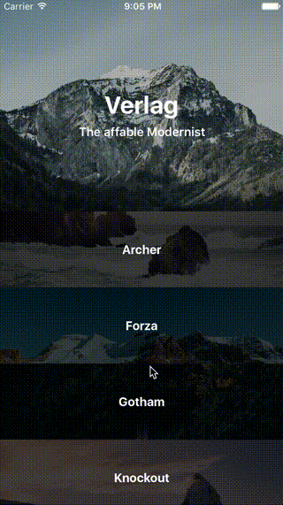

# SFFocusViewLayout

[](https://travis-ci.org/fdzsergio/SFFocusViewLayout)
[](https://codecov.io/github/fdzsergio/SFFocusViewLayout?branch=master)
[]()
[](http://cocoapods.org/pods/SFFocusViewLayout)
[]()
[](https://github.com/Carthage/Carthage)
[](http://cocoapods.org/pods/SFFocusViewLayout)
[](http://cocoapods.org/pods/SFFocusViewLayout)

## Overview
SFFocusViewLayout is a UICollectionViewLayout subclass for displaying focused content on UICollectionView which is the largest cell of all.

<p align="center" >
  
	

</p>

## Usage

SFFocusViewLayout contains three properties to customize the interface.

```swift
var standardHeight: CGFloat
var focusedHeight: CGFloat
var dragOffset: CGFloat
```

- _focusedHeight_ is the height cells should be when focused.  Defaults to 280
- _standardHeight_ is the height cells should be when collapsed.  Defaults to 100
- _dragOffset_ is the amount the user needs to scroll before the featured cell changes. Defaults to 180


## Versions

### Swift
If you want to use a Swift 3 implementation of this framework use a 3.0 or greater version

```ruby
pod 'SFFocusViewLayout', '~> 3.0'
```

### Objective–C
If you want to use a Objective–C implementation of this framework use a 2.0 or greater version

```ruby
pod 'SFFocusViewLayout', '~> 2.0'
```

## Installation

### CocoaPods

SFFocusViewLayout is available through [CocoaPods](http://cocoapods.org). To install
it, simply add the following line to your Podfile:

```ruby
pod 'SFFocusViewLayout'
```
### Carthage

You can also install it via [Carthage](https://github.com/Carthage/Carthage). To do so, add the following to your Cartfile:

```terminal
github 'fdzsergio/SFFocusViewLayout'
```

## Roadmap
- [x] Carthage support
- [x] Swift compatible
- [x] Swift version
- [x] Tests
- [x] Upgrade to Swift 3

## Author

Sergio Fernández, fdz.sergio@gmail.com

## Acknowledgement

This framework is heavily inspired by the Ultravisual example of [Ray Wenderlich](http://www.raywenderlich.com/99087/swift-expanding-cells-ios-collection-views).

## License

SFFocusViewLayout is available under the MIT license. See the [LICENSE](https://raw.githubusercontent.com/fdzsergio/SFFocusViewLayout/master/LICENSE) file for more info.
